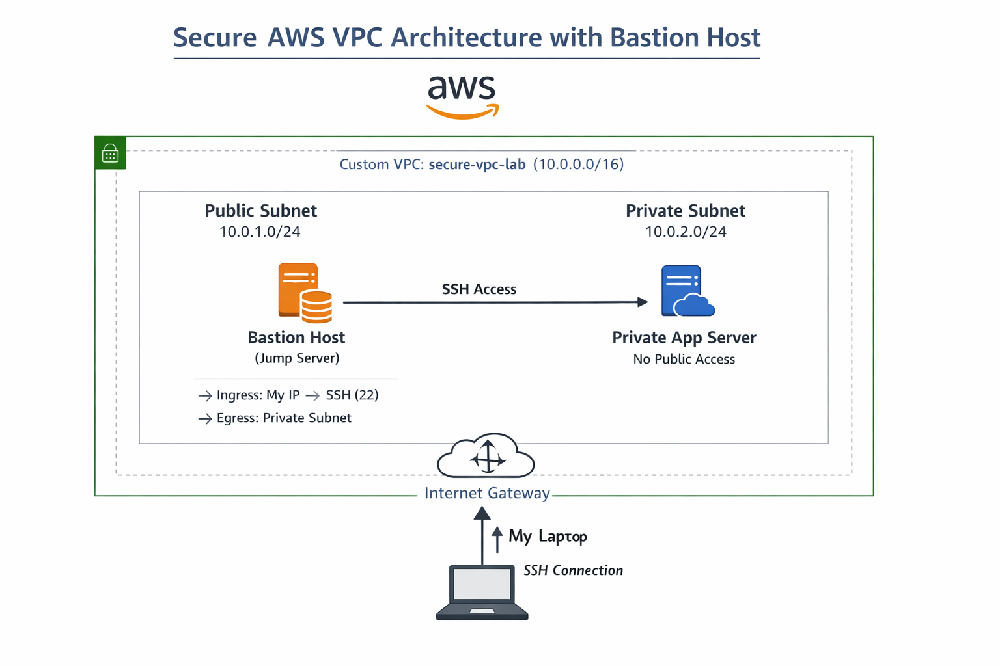

# AWS Secure VPC with Bastion Host Architecture

A production-style AWS networking project demonstrating secure infrastructure design using a custom VPC, public and private subnets, and controlled SSH access via a bastion host.

This project focuses on network isolation, least-privilege access, and real-world troubleshooting scenarios, aligning with best practices used in cloud engineering and DevOps environments.

---

## Project Overview

This project implements a secure Virtual Private Cloud (VPC) architecture where:

* A **bastion host** in a public subnet acts as the only entry point
* A **private EC2 instance** is completely isolated from the internet
* SSH access to the private instance is strictly controlled through the bastion host
* Network and security configurations enforce a least-privilege model

---

## Architecture



### Traffic Flow

> **Client → Bastion Host (Public Subnet) → Private EC2 Instance (Private Subnet)**

---

## Key Features

* Custom VPC with CIDR-based network segmentation
* Public and private subnet architecture
* Internet Gateway and route table configuration
* Bastion host for controlled SSH access
* Private EC2 instance with no public exposure
* Security group-based access control using least privilege
* SSH agent forwarding and ProxyJump configuration
* Real-world failure simulation and troubleshooting

---

## Technologies Used

* Amazon EC2
* Amazon VPC
* Internet Gateway
* Route Tables
* Security Groups
* Linux (Amazon Linux)
* SSH (OpenSSH, ProxyJump, Agent Forwarding)

---

## Repository Structure

```
aws-secure-vpc-bastion-architecture/
│
├── README.md
├── LICENSE
├── .gitignore
│
├── docs/
│   ├── acess-flow/
|   │   ├── bastion-access-flow.md
|   |
│   ├── architecture/
|   │   ├── architecture-diagram.png
|   │   ├── architecture-diagram.md
|   |
│   ├── network/
|   │   ├── network-design.md
|   |
│   ├── troubleshoot/
|   │   ├── failure-scenarios.md
│
├── scripts/
│   ├── bastion-setup.sh
│   ├── ssh-config
│   ├── bastion-setup-usage.sh
│   ├── ssh-config-apply.sh
│
├── screenshots/
│   ├── bastion-host/
|   │   ├── bastion-host-t2-micro-instance.png
|   │   ├── bastion-sg.png
|   │   
│   ├── connection/
|   │   ├── bastion-host-connected.png
|   │   ├── connect-private-app-server-from-bastion-host.png
|   │   ├── hide-key-pair-from-public-visibility-in-bastion-host.png
|   │   ├── upload-key-pair-to-bastion-host.png
|   │   
│   ├── internet-gateway-creation/
|   │   ├── attach-igw-to-vpc.png
|   │   ├── igw.png
|   │   
│   ├── private-app-server/
|   │   ├── private-app-server.png
|   │   ├── private-app-sg.png
|   │   
│   ├── route-table-creation/
|   │   ├── config-route-table.png
|   │   ├── create-route-table.png
|   │   ├── edit-route-table.png
|   │   
│   ├── subnet-creation/
|   │   ├── public-subnet-creation/
|   |   │   ├── config-public-subnet.png
|   |   │   ├── create-public-subnet.png
|   |   │   ├── public-subnet-details.png
|   │   
|   │   ├── private-subnet-creation/
|   |   │   ├── config-private-subnet.png
|   |   │   ├── create-private-subnet.png
|   |   │   ├── no-internet-access-to-public-subnet.png
|   │   
│   ├── vpc-creation/
|   │   ├── create-vpc.png
|   │   ├── vpc-details.png
│
├── configs/
│   ├── security-groups.md
│   ├── route-tables.md
│   ├── subnet-config.md
│
└── deployment/
    └── step-by-step-setup.md
```

---

## Step-by-Step Deployment

A complete setup guide is available here:

* deployment/step-by-step-setup.md

This guide walks through:

* VPC creation
* Subnet configuration
* Bastion host setup
* Private EC2 deployment
* Secure SSH access

---

## Security Architecture

### Bastion Host

* Deployed in public subnet
* Accessible via SSH from a restricted IP
* Acts as the only entry point

### Private EC2 Instance

* No public IP assigned
* SSH access allowed only from bastion host
* Fully isolated from the internet

### Security Groups

* Bastion: SSH allowed only from user IP
* Private instance: SSH allowed only from bastion security group

---

## Failure Scenarios and Troubleshooting

This project includes real-world failure simulations such as:

* Unable to SSH into bastion host
* SSH failure from bastion to private instance
* Incorrect security group configurations
* SSH key permission errors
* Accidental exposure of private instance

Detailed explanations and fixes are documented in:

* docs/failure-scenarios.md

---

## SSH Access (Professional Workflow)

Using SSH configuration with ProxyJump:

```
ssh bastion
ssh private-app
```

This enables seamless and secure access without manual multi-step SSH commands.

---

## Cost Estimation

* EC2 (t2.micro × 2): ~$12–16/month
* VPC, Subnets, Route Tables: Free
* Internet Gateway: Free

### Cost Optimization

* Stopped instances when not in use
* Avoided NAT Gateway and Load Balancers
* Deleted resources after project completion

---

## Learning Outcomes

* Designing secure AWS VPC architectures
* Implementing bastion host access patterns
* Configuring route tables and subnet isolation
* Applying least-privilege security principles
* Troubleshooting real-world networking issues
* Managing SSH access securely and efficiently

---

## Use Cases

* Cloud Security Architecture
* DevOps Infrastructure Design
* Production Network Setup
* Interview Demonstration Project

---

## Future Enhancements

* Multi-AZ deployment for high availability
* NAT Gateway for outbound internet from private subnet
* AWS Systems Manager Session Manager (SSH alternative)
* Infrastructure as Code using Terraform or CloudFormation

---

## Author

**Anup Das**
anupddas8@gmail.com

GitHub: https://github.com/anupddas/aws-secure-vpc-bastion-architecture.git

---

## License

This project is licensed under the MIT License.

---

## Conclusion

This project demonstrates a secure and production-aligned AWS network architecture using a bastion host to control access to private resources.
